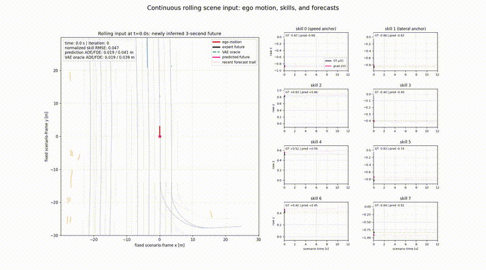
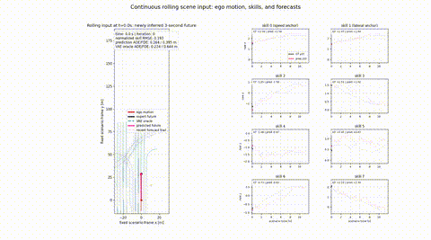
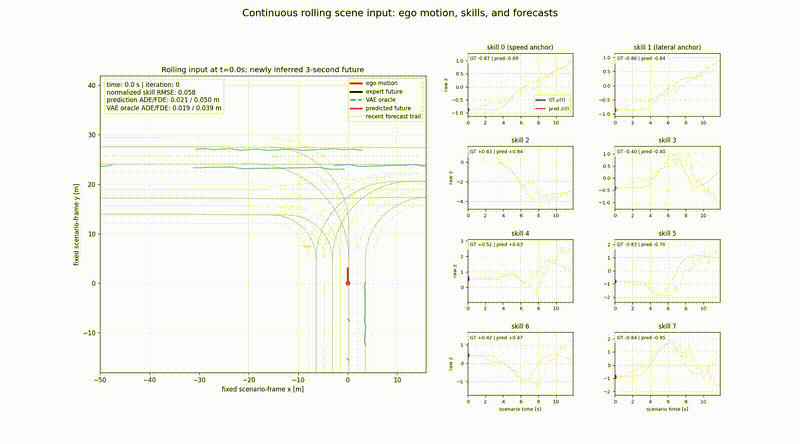
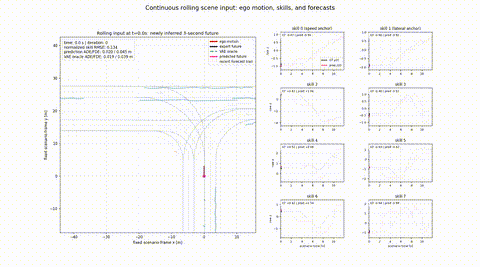
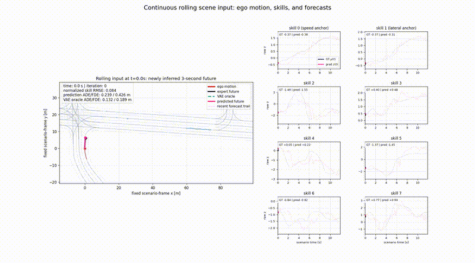
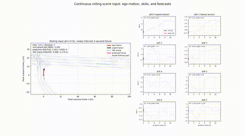
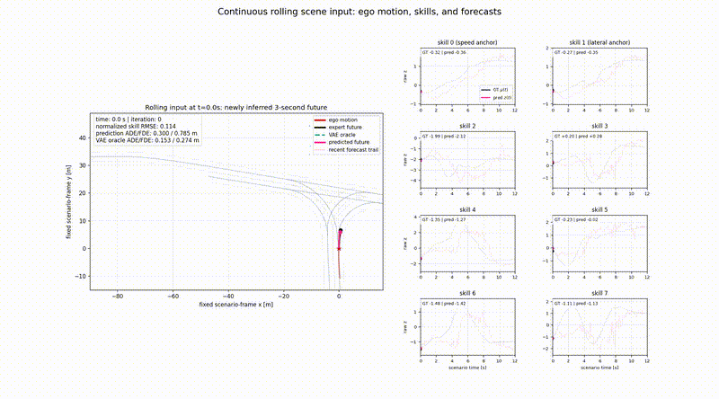

# SkillFormer — Single-mode Skill Regression

Wayformer scene encoding followed by a single VAE-latent regression head. The
model is trained only with direct skill-space supervision.
---
## 🛠️ Environment Setup & Environment Prerequisites

### System Requirements
- **OS**: Windows Subsystem for Linux 2 (WSL2) — **Ubuntu 22.04 LTS**
- **Python**: `3.9`
- **Conda Environment**: `wayformer`
- **External Dependencies**: `ffmpeg` (required for rendering rolling scene videos)

### 1. Create and Activate Conda Environment
```bash
conda create -n wayformer python=3.9 -y
conda activate wayformer
```
### 2. Install Dependencies
```bash
# Install PyTorch Lightning & core packages
pip install pytorch-lightning tqdm matplotlib

# Install system dependency for MP4 video export
sudo apt update && sudo apt install -y ffmpeg
```
⚠️ Note for WSL Users (Multiprocessing Fix):
In WSL2 environments, Python multi-processing (multiprocessing.Process / mp.Queue) may lock up when interacting with C++ database handles (NuPlan map API).
If dataset processing hangs, ensure SingleMachineParallelExecutor(use_process_pool=False) is set in Wayformer/wf_dataset.py for single-thread sequential processing.
---
## Architecture

```
Scene → Wayformer Encoder → single learned query
                              │
                     TransformerDecoder
                              │
                       embedding [256]
                              │
                       Linear(256→8)
                              │
                         z_pred [8]
                              │
              ┌───────────────┴────────────────┐
              │                                │
      normalized MSE                  frozen VAE.decode
              │                                │
GT trajectory → frozen VAE.encode             trajectory [30,2]
              │
           mu_gt [8]
```

- **Single-mode output**: One scene produces one 8-D skill latent (`z_pred`) and one trajectory (30 time steps, $(x,y)$ coordinates).
- **Frozen VAE**: The VAE encoder and decoder are frozen during training.
- **Direct Skill Supervision**: Training loss is strictly normalized MSE(`z_pred`, `mu_gt`). VAE decoding is used only during prediction/evaluation.

Old multi-modal checkpoints and their reported metrics are not compatible with
this architecture. Retraining is required.
---
## 🚀 Quick Start Pipeline

### 1. Model Training
Run training on the NuPlan dataset (configured via JSON):
```bash
python train_wf.py --config_dir config/wayformer.1.json
```
Checkpoints and logs will be saved automatically under `output/wayformer.skill_only/version_X/checkpoints/`.

### 2. Evaluation
Evaluate the trained model on the validation set using the best checkpoint (e.g. Lowest val_loss):
```bash
python eval.py --ckpt output/wayformer.skill_only/version_3/checkpoints/epoch=64-val_loss=0.1399.ckpt
```
Evaluation metrics will be written to `eval_result.txt`.

### 3. Skill & Trajectory Visualization
#### A. Compare Inferred Skills against GT (Distribution / Latents)
```bash
python visualize_skills.py \
  --ckpt output/wayformer.skill_only/version_3/checkpoints/epoch=64-val_loss=0.1399.ckpt \
  --mode val \
  --max-samples 256
```
Outputs dashboard PNGs, error heatmaps, and stats CSV under `output/skill_visualization/`.
#### B. Rolling Scene Inference & Video Generation
Reconstructs inputs at every NuPlan iteration (10Hz) to generate continuous closed-loop rolling trajectory predictions:
```bash
python visualize_rolling_scene_video.py \
  --ckpt output/wayformer.skill_only/version_3/checkpoints/epoch=64-val_loss=0.1399.ckpt \
  --mode val \
  --scene-index 0 \
  --output-dir vis_results
```
Output MP4 videos will be saved in `vis_results/rolling_<token>_iter000-XXX.mp4`.

---

## 📊 Experimental Results

### 1. Quantitative Evaluation Metrics
*(Results extracted from `eval_result.txt` on NuPlan Validation Set)*

| Model Architecture | Epochs  |  Val Loss  | minADE (m) ↓ | minFDE (m) ↓ | Miss Rate (%) ↓ |
| :--- |:-------:|:----------:|:------------:|:------------:|:---------------:|
| **Wayformer Skill-Only (Best Checkpoint)** | 64 / 70 | **0.1399** |  **0.2335**  |  **0.6180**  |    **4.91%**    |

> *Note: Exact metrics — minADE: `0.23357309`, minFDE: `0.61799184`, Miss Rate: ` 0.0490566` (4.91%).*

### 2. Qualitative Scenario Performance Hierarchy
Representative scene-level qualitative evaluations across continuous rolling NuPlan validation scenarios:

| Scene Performance Hierarchy | Scenario Type | Index | Skill RMSE ↓ | Mean Prediction ADE ↓ | Rolling Prediction Visual Demo |
| :--- | :--- | :---: | :---: | :---: | :---: |
| **Excellent** | `stationary` | Index 50 | **0.1163** | **0.0245m** |  |
| **Good** | `traversing_traffic_light_intersection` | Index 100 | **0.2498** | **0.4155m** |  |
| **Medium** | `waiting_for_pedestrian_to_cross` | Index 0 | **0.4974** | **0.8332m** |  |
| **Medium** | `waiting_for_pedestrian_to_cross` | Index 20 | **0.5281** | **0.9311m** |  |
| **Poor** | `traversing_traffic_light_intersection` | Index 15 | **0.5093** | **1.0310m** |  |
| **Poor** | `traversing_traffic_light_intersection` | Index 200 | **0.5102** | **1.0290m** |  |
| **Range / Edge Case** | `starting_protected_cross_turn` | Index 5 | **0.7131** | **1.6636m** |  |

> 💡 **Note**: The video paths above are relative to the project root directory (`/home/thsxw/real-Skillformer-master/real-Skillformer-master/`). You can open or play them directly using `vlc` or `ffplay`.

---
### 3. Per-Skill Latent Error Summary (8-D Latent Space)
Detailed fitting performance across individual Skill dimensions ($z_0 \sim z_7$) extracted from `visualize_skills.py`:

| Skill ID | Raw MAE | Raw RMSE | Norm MAE | Norm RMSE ↓ | Correlation ($r$) ↑ | Behavioral Intent Inference |
| :---: | :---: | :---: | :---: | :---: | :---: | :--- |
| **Skill 0** | 0.0896 | 0.1225 | 0.0911 | **0.1246** | **0.996** | Straight / Stationary / Low Speed |
| **Skill 1** | 0.0833 | 0.1151 | 0.0853 | **0.1180** | **0.996** | Cruise / Constant Speed |
| **Skill 2** | 0.2301 | 0.3210 | 0.2633 | **0.3674** | 0.979 | Sharp Turning / High-Nonlinear Maneuvers |
| **Skill 3** | 0.1150 | 0.1600 | 0.1077 | **0.1498** | 0.982 | Moderate Acceleration / Deceleration |
| **Skill 4** | 0.1602 | 0.2416 | 0.1389 | **0.2095** | 0.971 | Gentle Lane Offset / Micro-adjustments |
| **Skill 5** | 0.1589 | 0.2423 | 0.1792 | **0.2733** | 0.969 | Dynamic Nudging / Interactive Yield |
| **Skill 6** | 0.1302 | 0.1915 | 0.1076 | **0.1584** | 0.977 | Smooth Curve Following |
| **Skill 7** | 0.2517 | 0.3815 | 0.2108 | **0.3196** | 0.940 | Complex Intersection Crossings |

> 💡 **Key Observations**:
> - **High Linear Alignment**: All Skill dimensions maintain a correlation coefficient $r \ge 0.940$, with Skill 0 and Skill 1 reaching **0.996**, indicating no latent collapse.
> - **Non-linear Hardness**: Skill 2 and Skill 7 represent high-curvature/complex interaction maneuvers, exhibiting higher RMSE ($\approx 0.32 \sim 0.36$) compared to longitudinal cruising Skills ($\approx 0.12$).

---

### 4. Version Comparison (Version 2 vs. Version 3)

| Model Version | Key Architectural / Loss Focus | Protected Turn ADE (Index 5) ↓ | Stationary ADE (Index 50) ↓ | Overall Performance Trade-off |
| :---: | :--- | :---: | :---: | :--- |
| **Version 2** | Strict Skill-space Constraint | 1.9155m | 0.0195m | Lower Skill RMSE, but higher physical turning offset. |
| **Version 3** | Optimized decoder mapping & trajectory alignment | **1.6636m** (-13.1%) | 0.0245m | **Significant reduction in physical trajectory ADE for complex turns**, with minor elasticity relaxation in latent space. |

---
## Analysis of New Model
### Advantages:
- **Perform better in Edge Cases**:In the two most accident-prone high-risk scenarios—sharp-angle turns (Index 5) and complex multi-vehicle game intersections (Index 15, 200)—the new model achieved a significant reduction in ADE (Aspect-Definition Error) of around 14%.
- **Perform better in Physical entity fitting**:The Decoder's ability to transform Skill latent vectors into physical coordinates (x, y trajectories) has been significantly improved.

### Limitations:

- **Skill performance is severely polarized**:The `norm RMSE` is as low as 0.1180–0.1246, and the correlation coefficient `corr` is as high as 0.996. This indicates that the latent space fit is almost perfect for low-dynamic operations such as straight-line driving, cruising, and standing still. However, `Skill 2` had the highest `normal RMSE` at 0.3674; `Skill 7` had a `normal RMSE` of 0.3196, and its correlation coefficient dropped to 0.940 (the lowest in the entire competition).**The two skills often correspond to complex maneuvers such as sharp turns, strong deceleration to avoid obstacles, or frequent lane changes. Networks lack the ability to capture these highly non-linear action clusters.**
- **The physics error remains high in edge cases**: In the starting_protected_cross_turn scenario (Index 5, protected turn scenario), although ADE has improved from 1.9155m to 1.6636m, in real-world autonomous driving control, a trajectory yaw distance of 1.66m (equivalent to half a lane width) is **still not safe enough**, and **the vehicle still risks crossing the line or cutting off the curve.**
- **The trade-off between latent space constraints and physical coordinate fitting**: To reduce the ADE in physical space, the new model has led to an overall increase in the Skill RMSE value in latent space (for example, the Skill RMSE in static scenes changes from 0.0525 to 0.1163). This indicates that the decoder currently relies primarily on **sacrificing some latent space smoothness to hard-substitute physical coordinates.**
---
## Key Config

```json
{
  "use_z_norm": true,
  "z_stats_path": "z_stats.pt",
  "vae_weight_path": "pth/trajectory_vae_8d_best.pth",
  "vae_latent_dim": 8,
  "learning_rate": 0.0003
}
```
